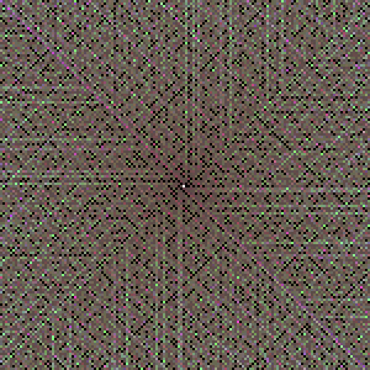

ulam
====

An application to render the
[Ulam spiral](http://en.wikipedia.org/wiki/Ulam_spiral).

    usage:  ./ulam [-b <beg>] [-a | -p] -s <size>
     
    Draw an Ulam spiral into an image that is sent to the standard
    output.
     
    -b <beg>   Start with value <beg> at center.
    -a         Output an ASCII plot.
    -p         Output a PPM image.
    -s <size>  Draw spiral in a square of width <size> cells.
     
    By default, start with the beginning value 1 at the center, and
    decide on the basis of <size> what output format to use. Without
    specification of '-a' or '-p', output as an ASCII plot for
    <size> smaller than 24; otherwise output a PPM image.
     
    If specified, <beg> must be a POSITIVE INTEGER.
    <size> MUST be specified and must be a POSITIVE INTEGER.

Installation
------------

In order to build 'ulam', one needs to have the following installed in a
unix-like system (such as GNU/Linux or Cygwin):
 * make
 * g++
 * convert (part of the ImageMagick toolset)
 * exuberant-ctags

After one uses git to clone this project (or otherwise downloads the files into
a directory called 'ulam'), one may simply change to the 'ulam' directory and
type 'make'.

Sieve of Eratosthenes
---------------------

As a part of the program, I have implemented my own, custom version of the
Sieve of Eratosthenes. It not only efficiently finds all of the primes up to a
limit but also efficiently constructs the prime factorization of every natural
number up to the limit.

The complete prime factorization of every number on the spiral might in
principle be useful for coloring the plot in interesting ways. The
factorization includes not only the list of primes in the factorization (which
is fairly easy to get out of the standard sieve) but also the power of each
prime in the factorization.

At the moment, a basic, two-component coloring scheme is implemented and
described below.

Example Output
--------------

For sizes up to 23, the default output is an ASCII plot, in which an at-sign
represents a prime. The following example is for size=23.

    - - - - - - @ - - - - - - - - - - - @ - - - @
    - @ - - - @ - - - - - - - @ - - - - - @ - - -
    @ - - - - - - - - - @ - - - @ - @ - - - @ - @
    - - - @ - - - - - @ - - - - - - - - - @ - @ -
    - - - - @ - - - @ - @ - - - - - - - - - - - -
    - - - - - - - - - - - @ - @ - - - - - @ - - -
    @ - - - @ - @ - - - @ - - - - - - - @ - - - @
    - - - - - - - - - - - @ - @ - - - @ - - - - -
    - - @ - - - @ - @ - - - - - @ - @ - @ - - - -
    - @ - @ - @ - @ - @ - - - @ - - - - - - - @ -
    - - - - - - - - - - @ - @ - @ - - - - - - - -
    - - - - - @ - - - @ - - @ @ - @ - @ - @ - - -
    - - - - - - @ - @ - @ - - - - - - - - - - - -
    - - - - - - - @ - - - @ - - - - - - - - - - -
    @ - @ - - - @ - @ - - - @ - - - @ - @ - - - @
    - - - @ - - - @ - - - - - @ - - - - - @ - @ -
    - - - - - - - - @ - - - - - - - - - - - @ - -
    - - - @ - @ - - - - - @ - - - @ - - - @ - - -
    @ - - - @ - - - - - - - - - - - @ - - - - - -
    - @ - - - - - @ - - - @ - @ - - - - - - - - -
    - - - - - - @ - @ - - - @ - - - - - @ - - - @
    - @ - - - - - - - - - @ - @ - - - - - @ - - -
    - - @ - - - - - - - - - - - @ - @ - - - - - -

For sizes above 23, the default output is a PPM image. The following example is
for size=150.

Each black pixel is a prime. For every other pixel,
 * the intensity of the red component is proportional to the number of atomic
   prime factors (to the sum of the exponents in the prime factorization);
 * the intensity of the green component is proportional to the cube of the
   number of distinct primes in the factorization; and
 * the intensity of the blue component is proportional the -0.4 power of the
   ratio of the largest prime in the factorization to the number being
   factored.

The brighter the pixel, less the prime in each of several senses. The greater
the red component, the more composite the number in the sense of having a large
number of factors, even if there be repeated factors. The greater the green
component, the more composite the number in the sense of having a larger number
of distinct primes in the factorization. The larger the blue component, the
more composite the number in that the largest of the prime factors is a smaller
fraction of the factored number.

